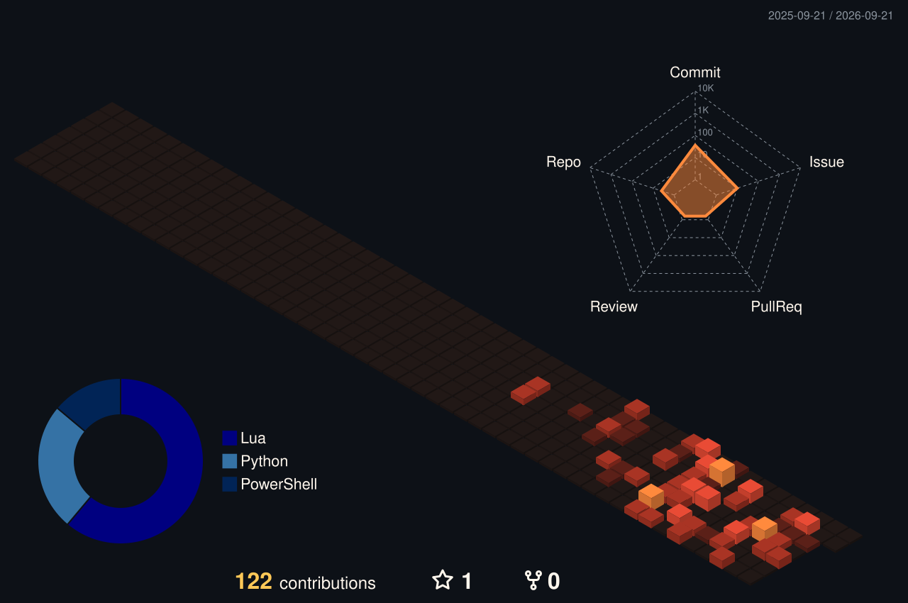

  

  <h1>🍅 番茄 / fanqiecd</h1>
  
<strong>全栈工具开发者 · Game Mod &amp; Web Tool Builder</strong>

  
把游戏里的想法与日常需求，做成真正可用的模组和 Web 工具。 
  <em>Turning game ideas and everyday needs into practical mods and web tools.</em>

  

  
  

---

## 🧭 About / 关于我

我喜欢从一个具体问题出发，把玩法规则、数据和界面接成可以真正运行的工具。

- 在游戏模组中处理 **Lua 逻辑、SQL 数据注册、UI 入口、兼容层与本地化**。
- 在 Web 项目中使用 **Vue、JavaScript 与 CSS**，把工具部署成可以直接访问的页面。
- 倾向于小而完整的实现：先解决真实问题，再补齐使用说明和维护入口。

I build small, complete systems across game mods and the web: practical behavior, usable interfaces, and documentation that helps the next person run the project.

## 🛠️ Capabilities / 能力地图

| 方向 | 能做什么 | 真实输出 |
|:--|:--|:--|
| **Game Mod Systems** | 连接 Lua 玩法逻辑、SQL 数据与游戏内 UI；处理兼容和本地化 | `BP_ResourcePlanter` |
| **Web Tool Shipping** | 用 Vue / JavaScript / CSS 构建并部署浏览器工具 | `EquipSheet` |
| **Open Repository Craft** | 保持代码、使用说明、变更记录与公开入口一致 | GitHub repositories |

  

## 🌱 Featured Builds / 精选作品

### [BP_ResourcePlanter](https://github.com/fanqiecd/BP_ResourcePlanter)

> **Builder Plants Resources · Civilization VI Mod**

让建造者通过独立入口在格子上直接种植资源与地貌，最终留下真实对象，而不是占位改良。

- **解决：** 把资源与地貌种植做成游戏内可操作流程
- **实现：** 玩法校验、数据注册、兼容包装、UI 选择器与本地化文本
- **技术：** Lua · SQL · Civilization VI UI
- **公开内容：** 安装方法、双语工坊说明、变更记录

**[View repository →](https://github.com/fanqiecd/BP_ResourcePlanter)**

### [EquipSheet](https://github.com/fanqiecd/EquipSheet)

> **Vue Web Tool · [Open live tool ↗](https://equip-sheet.vercel.app)**

一个使用 Vue、JavaScript 与 CSS 构建并部署到 Vercel 的公开工具项目。

**Verified stack:** Vue · JavaScript · CSS · HTML · **[View source →](https://github.com/fanqiecd/EquipSheet)**

  
<strong>More repositories / 更多仓库</strong>

   
  <a href="https://github.com/fanqiecd/PlayerSuperStart">PlayerSuperStart</a> ·
  <a href="https://github.com/fanqiecd/hoi4_mod_copy">hoi4_mod_copy</a>

## 📊 GitHub Activity / 开发足迹

<picture>
  <source media="(prefers-color-scheme: dark)" srcset="https://raw.githubusercontent.com/fanqiecd/fanqiecd/output/github-contribution-grid-snake-dark.svg" />
  <source media="(prefers-color-scheme: light)" srcset="https://raw.githubusercontent.com/fanqiecd/fanqiecd/output/github-contribution-grid-snake.svg" />
  
</picture>

  

---

  
<strong>Make the useful thing. Keep it playable. Keep it understandable.</strong>

  
模板设计灵感来源：© <a href="https://github.com/zyh3699">Zephyr Zhong</a> · Adapted into the Tomato Workshop profile.

  

